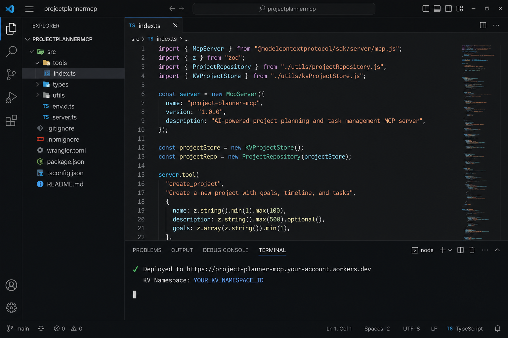
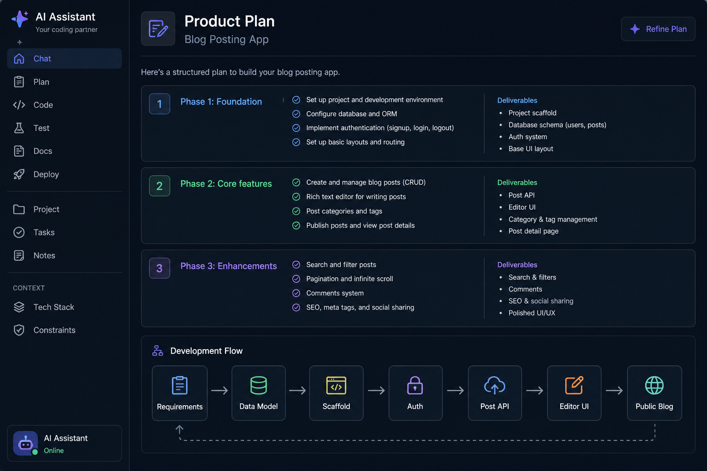

# Project Planner MCP

A remote [Model Context Protocol](https://modelcontextprotocol.io/) server that lets AI assistants create projects, manage todos, and build structured product plans. Runs on Cloudflare Workers with KV storage and Durable Objects.





## Features

- **Project management** — create, list, get, and delete projects
- **Todo tracking** — add, update, list, and remove todos with status and priority
- **AI-native** — expose planning tools to Cursor, Claude Desktop, or any MCP client
- **Serverless** — deploys to Cloudflare Workers with no auth setup required

## MCP Tools

| Tool | Description |
|------|-------------|
| `create_project` | Create a new project |
| `list_projects` | List all projects |
| `get_project` | Get a project and its todos |
| `delete_project` | Delete a project and all its todos |
| `create_todo` | Add a todo to a project |
| `update_todo` | Update title, description, status, or priority |
| `delete_todo` | Remove a todo |
| `get_todo` | Get a single todo by ID |
| `list_todos` | List todos in a project (optional status filter) |

## Prerequisites

- [Node.js](https://nodejs.org/) 18+
- A [Cloudflare](https://dash.cloudflare.com/) account
- [Wrangler CLI](https://developers.cloudflare.com/workers/wrangler/) (installed via npm)

## Setup

```bash
git clone https://github.com/<your-username>/projectplannermcp.git
cd projectplannermcp
npm install
```

### Configure Cloudflare KV

Copy the example config and create a KV namespace:

```bash
cp wrangler.jsonc.example wrangler.jsonc
npx wrangler kv namespace create PROJECT_PLANNER_STORE
```

Copy the returned `id` into the `kv_namespaces` section of `wrangler.jsonc` (this file is gitignored and stays local).

## Development

```bash
npm run dev
```

The MCP endpoint is available at `http://localhost:8787/mcp`.

## Deploy

```bash
npm run deploy
```

After deployment, your server will be available at:

```
https://<worker-name>.<your-subdomain>.workers.dev/mcp
```

## Connect an MCP Client

### Cursor

Add to your MCP configuration:

```json
{
  "mcpServers": {
    "project-planner": {
      "command": "npx",
      "args": [
        "mcp-remote",
        "https://<your-worker>.workers.dev/mcp"
      ]
    }
  }
}
```

For local development, use `http://localhost:8787/mcp` instead.

### Claude Desktop

In **Settings → Developer → Edit Config**, add the same `mcpServers` block above. Restart Claude Desktop to load the tools.

## Project Structure

```
projectplannermcp/
├── assets/          # Screenshots and branding
├── src/
│   └── index.ts     # MCP server and tool definitions
├── wrangler.jsonc   # Cloudflare Workers configuration
└── package.json
```

## Tech Stack

- [Cloudflare Workers](https://workers.cloudflare.com/) — serverless runtime
- [Cloudflare KV](https://developers.cloudflare.com/kv/) — project and todo storage
- [Durable Objects](https://developers.cloudflare.com/durable-objects/) — MCP agent hosting
- [MCP SDK](https://github.com/modelcontextprotocol) — protocol implementation

## Scripts

| Command | Description |
|---------|-------------|
| `npm run dev` | Start local development server |
| `npm run deploy` | Deploy to Cloudflare Workers |
| `npm run type-check` | Run TypeScript checks |
| `npm run cf-typegen` | Generate Worker binding types |

## License

[MIT](LICENSE)
